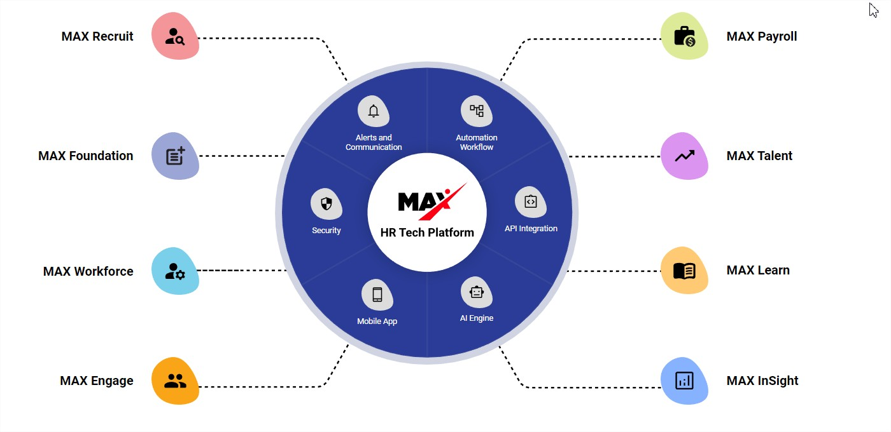

 <strong style="font-size: 20px;"> Human Resource Management Systems</strong>

    

    

  

 <strong> Table of content </strong> 

 
<ul>
    <li><a href="#introduction">Introduction  </a></li>
    <li><a href="#hrsystem">Human Resources Management Systems</a></li>
    <li><a href="#featuresbenefits">Features and benefits</a></li>
    <li><a href="#ai">AI in HR Systems</a></li>
    <li><a href="#conclusion">Conclusion</a></li>
</ul>

##  Introduction
 

Human resources (HR) management has long been a critical aspect of organizational management, as it involves managing the most valuable asset of any organization: its employees. However, as companies and their workforces continue to grow, retaining qualified employees and maintaining a healthy work environment has become increasingly challenging. To address these challenges, businesses have revolutionized their way of approaching HR management through the usage of HR systems.  
By enabling the easy storage of employee information and automating many of the tasks that were previously performed manually, HR systems have freed up HR professionals to focus on high-impact projects. 
In this document, we will discuss HR systems in detail, including their workflow, features and benefits. Additionally, we will explore the role of artificial intelligence (AI) in HR systems, particularly in creating meaningful insights to support HR decision-making.

 

##  Human Resources Management Systems HRMS
 

An HR system is a software platform designed to streamline and automate HR management tasks, such as managing employee data, recruitment, onboarding, benefits administration, and other HR-related activities. HRMS (Human Resources Management System) offers an all-in-one solution that ensures centralized, secure, and organized employee data.

   
  Adrenalin All-in-one Solution

Such HRMS ensures a measurable ROI along with ease of usage and scalability.

The workflow of an HR system typically includes the following subsections:

####   Recruitment
- &nbsp; Posting job openings
- &nbsp; Receiving and reviewing applications
- &nbsp; Scheduling interviews

#### Onboarding new hires
- &nbsp; Setting up new employee profiles
- &nbsp; Conducting background checks
- &nbsp; Verifying employment eligibility
- &nbsp; Assigning training modules

#### Employee data management
- &nbsp; Tracking employee information
- &nbsp; Recording attendance and hours worked
- &nbsp; Managing benefits enrollment and administration
- &nbsp; Updating employee records

#### Performance management
- &nbsp; Setting and tracking employee goals
- &nbsp; Conducting performance reviews
- &nbsp; Providing feedback and coaching

#### Training and development
- &nbsp; Creating and managing training programs
- &nbsp; Monitoring employee progress and performance
- &nbsp; Providing resources for skill development

 

## Features and benefits
 

HRMS software offers numerous benefits and features that can help businesses streamline their HR operations and improve their overall efficiency. Some of the key benefits and features of HRMS include:

### Centralized Employee Data Management
&nbsp;&nbsp;&nbsp;&nbsp;&nbsp;HRMS provides a centralized database for storing and managing employee data, making it easy for HR professionals to access and update &nbsp;&nbsp;&nbsp;&nbsp;&nbsp;employee information. This feature ensures data accuracy and reduces the risk of errors that can occur when data is stored in multiple &nbsp;&nbsp;&nbsp;&nbsp;&nbsp;locations.

### Time and Cost Savings
&nbsp;&nbsp;&nbsp;&nbsp;&nbsp;HRMS automates many HR tasks, such as data entry, reporting, and compliance management, saving HR professionals time and reducing &nbsp;&nbsp;&nbsp;&nbsp;&nbsp;the likelihood of costly errors. It also reduces paperwork, storage, and printing costs associated with manual HR processes.

### Increased Compliance
&nbsp;&nbsp;&nbsp;&nbsp;&nbsp;HRMS ensures compliance with labor laws and regulations by automating compliance management processes, such as tracking hours &nbsp;&nbsp;&nbsp;&nbsp;&nbsp;worked, managing benefits enrollment and administration, and updating employee records. It helps ensure that organizations stay   &nbsp;&nbsp;&nbsp;&nbsp; up-to-date with legislative compliance requirements.

### Data Security
&nbsp;&nbsp;&nbsp;&nbsp;&nbsp;HRMS provides secure data storage and access control features that ensure sensitive employee data is protected from unauthorized access &nbsp;&nbsp;&nbsp;&nbsp;&nbsp;or data breaches.

### Data-Driven Decisions
&nbsp;&nbsp;&nbsp;&nbsp;&nbsp;HRMS generates reports and insights that enable HR professionals to make data-driven decisions. By analyzing employee data,  &nbsp;&nbsp;&nbsp;&nbsp; HR professionals can identify trends, opportunities for improvement, and potential risks that may impact the organization's workforce.

### Sustainable Scaling
&nbsp;&nbsp;&nbsp;&nbsp;&nbsp;HRMS supports business growth by offering scalable solutions that can accommodate the organization's expanding workforce. It allows for &nbsp;&nbsp;&nbsp;&nbsp;&nbsp;increased efficiency in managing employee data and automating HR tasks, reducing the need for additional HR staff as the company grows.

 

## AI in HR Systems
 

AI is increasingly being integrated into HR systems to create meaningful insights and improve decision-making. For example, AI can analyze employee data to identify patterns and trends related to employee turnover, employee engagement, and workforce demographics. This can help HR professionals make more informed decisions about workforce planning, retention, and development.

AI can also be used to automate routine HR tasks, such as scheduling interviews and answering frequently asked questions. This can help reduce the administrative burden on HR staff and free up their time to focus on more strategic initiatives.

 

##  Conclusion
 

In conclusion, HRMS has become an essential tool for organizations to streamline their HR processes, allowing them to manage employee data, recruitment, onboarding, benefits administration, performance management, and training and development. It helps organizations to improve efficiency, increase productivity, and save time and resources.

Adrenalin Max Suite is an ideal HRMS solution for companies of all sizes. It offers comprehensive HR functionalities that are highly configurable and customizable to meet an organization's unique needs. The suite is designed to leverage AI and automation to help organizations make data-driven decisions and achieve sustainable scaling. With Adrenalin Max Suite, organizations can streamline their HR processes, increase productivity, and focus on high-impact projects that drive business success.

Check Adrenalin HCM suite solution for more information [Adrenalin](https://www.myadrenalin.com/)

